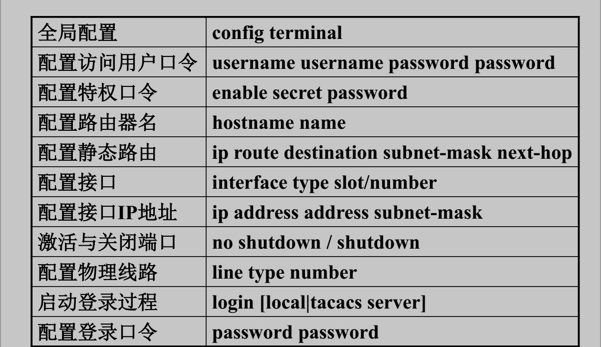
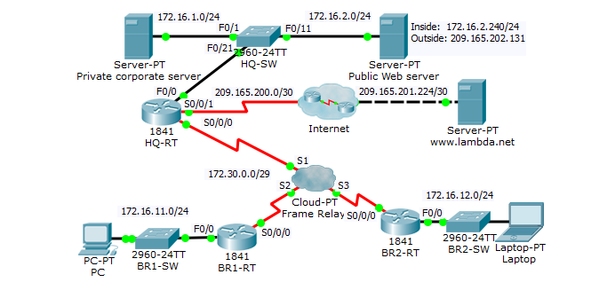

# 网络工程管理
---
CLI的使用与IOS基本命令
---
（1）用户模式和特权模式的切换
```
Router>
Router> enable
Router#
Router# disable
Router>

//"Router"是路由器名字。">"代表用户模式，"#"代表特权模式
```
（2）基本IOS命令

配置R1
```
Router> enable
Router# configure terminal
Router(config)# hostname R1
//配置路由器的名字为‘R1’，设置立即生效
R1(config)# interface fastEthernet0/0
R1(config-if)# ip address 172.16.1.1 255.255.255.0
R1(config-if)# speed 100
R1(config-if)# duplex full
//以上配置以太接口的速率和全双工工作状态，默认速率和全双工状态都是自适应（auto）
R1(config-if)# no shutdown
//开启以太网口，因为默认时路由器各个接口是关闭的
R1(config-if)# exit //退回上一级模式

R1(config)#interface Serial0/0/0
R1(config-if)#ip address 172.16.12.1 255.255.255.0
R1(config-if)#no shutdown
R1(config-if)#end
R1#copy running-config startup-config
R1#show ip interface brief

```
基本的路由配置任务
---


基本配置命令
---

基本配置命令举例
---
//注意屏蔽域名查找
```language
Router>enable  //进入特权EXEC模式
Router#configure terminal  //进入全局配置模式
Router(config)#hostname iRouter  //配置主机名
iRouter(config)#no ip domain-lookup  //屏蔽域名查找
iRouter(config)#enabe secret Privacy  //设置enable特权口令
iRouter(config)#service password-encryption  //加密所有口令
iRouter(config)#line console 0			//进入控制台配置模式
iRouter(config-line)#exec-timeout 0 0   //设置控制台超时时间
iRouter(config-line)#login			//启动登录过程
iRouter(config-line)#password conpassword  //设置登录口令
```
```language
iRputer#show running-config   //查看当前配置
iRputer#copy running-config startup-config  //保存当前配置
iRputer#erase startup-config   //删除启动配置
iRputer#reload  //重新加载路由器
```
![]/(./pic4.png)
![]/(./pic5.png)
![]/(./pic6.png)
![]/(./pic7.png)
《网络设计》项目实验一
===


```
DLSW1>enable
DLSW1#configure terminal
DLSW1(config)#spanning-tree vlan 1,110 priority 12288
DLSW1(config)#spanning-tree vlan 120 priority 16384
DLSW1(config)#end
```
VTP
---
VTP(VLAN中继协议/虚拟局域网干道协议 VLAN Trunking Protocol)，它是思科私有协议。在稍微大型一点的网络中，会有多个交换机，同时也会有多个VLAN，如果在每个交换机上分别把VLAN创建一遍，这会是一个工作量很大的任务。假设网络中有M个交换机，共划分了N个VLAN，则为了保证网络正常工作，需要在每个交换机上都创建N个VLAN，共M×N个VLAN，随着M和N的增大，这项任务将会枯燥而繁重。VTP协议可以帮助我们减少这些枯燥繁重的工作。管理员在网络中设置一个或者多个VTP Server，然后在Server上创建和修改VLAN，VTP协议会将这些修改通告其它交换机上，这些交换机更新VLAN信息(VLAN ID和VLAN Name)。VTP使得VLAN的管理自动化得多了。
VTP原理
---
VTP Domain(VTP域)：
由需要共享相同VLAN信息的交换机组成，只有在同一个VTP域(即VTP域的名字相同)的交换机才能同步VLAN信息。

```
DLSW1#configure terminal
DLSW1(config)#vtp mode server
DLSW1(config)#vtp domain EXAMNET
DLSW1(config)#vlan 110
DLSW1(config-vlan)#end
```


```
DLSW1#
DLSW1#configure terminal
DLSW1(config)#interface range GigabitEthernet 0/1 - 2
DLSW1(config-if-range)#switchport trunk encapsulation dot1q
DLSW1(config-if-range)#switchport mode trunk
DLSW1(config-if-range)#channel-group 12 mode on
DLSW1(config-if-range)#exit

DLSW1(config)#interface range FastEthernet 0/22 - 24
DLSW1(config-if-range)#switchport trunk encapsulation dot1q
DLSW1(config-if-range)#switchport mode trunk
DLSW1(config-if-range)#end
```

```
DLSW1#
DLSW1(config)#ip default-gateway 10.1.1.253
DLSW1(config)#interface vlan110
DLSW1(config-if)#ip address 10.1.110.251 255.255.255.0
DLSW1(config-if)#standby 110 ip 10.1.110.253
DLSW1(config-if)#standby 110 priority 150
DLSW1(config-if)#standby 110 preempt
DLSW1(config-if)#exit

DLSW1(config)#interface vlan120
DLSW1(config-if)#ip address 10.1.120.252 255.255.255.0
DLSW1(config-if)#standby 120 ip  10.1.120.253
DLSW1(config-if)#standby 120 preempt
DLSW1(config-if)#end
```

```
DLSW1#
DLSW1#configure terminal
DLSW1(config)#ip dhcp excluded-address 10.1.110.1 10.1.110.10
DLSW1(config)#ip dhcp excluded-address 10.1.110.251 10.1.110.255
DLSW1(config)#ip dhcp excluded-address 10.1.120.1 10.1.120.10
DLSW1(config)#ip dhcp excluded-address 10.1.120.251 10.1.120.255
DLSW1(config)#ip dhcp pool wlan
DLSW1(dhcp-config)#network 10.1.110.0 255.255.255.0
DLSW1(dhcp-config)#default-router 10.1.110.253
DLSW1(dhcp-config)#end
```
《网络设计》项目实验二
===



